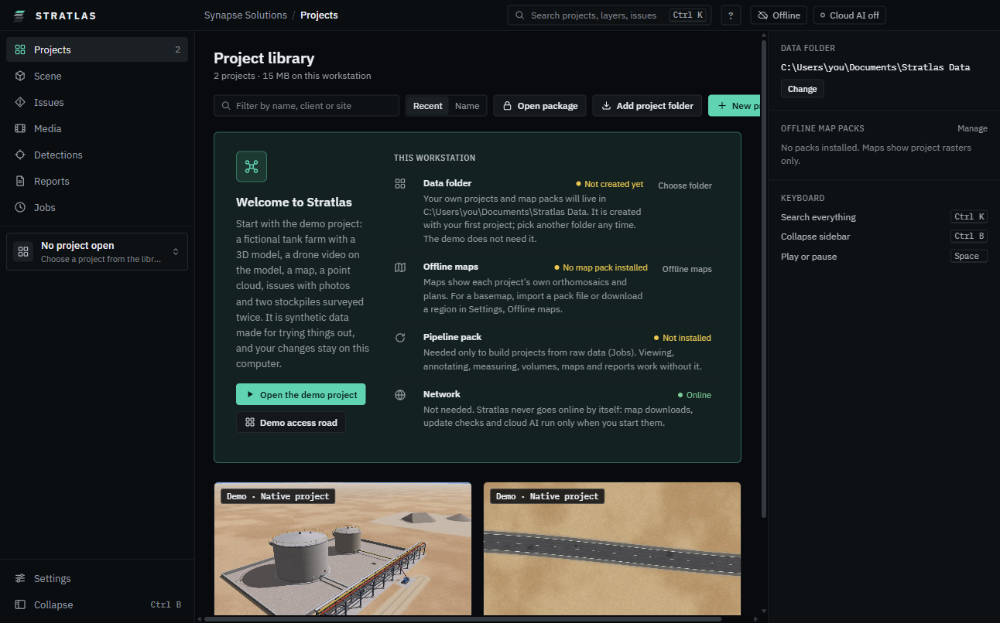
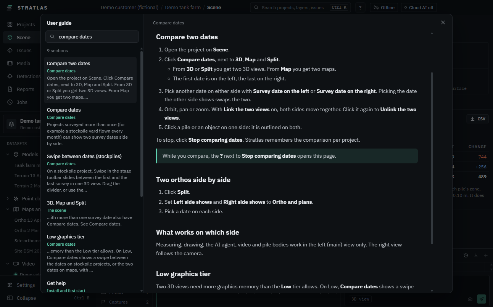

# Install and first start

{product} runs on one workstation and needs no network. Projects, maps and models stay on your disk.

## Install on Windows

1. Close {product} if it is running. The installer stops while it runs: "{product} is running. Close it and click Retry."
2. Run `{executable}-<version>-win-x64-setup.exe`. Choose the folder, or keep the default.
3. If Windows shows "Windows protected your PC", choose **More info**, then **Run anyway**. Only unsigned test builds show this.

No install rights? Use `{executable}-<version>-win-x64-portable.exe` instead. It runs from any folder.

To update, run the newer installer over the old version. Your projects, settings and keys stay. See [About and updates](12-settings.md#about-and-updates).

## Install on macOS

1. Open `{executable}-<version>-mac-<arch>.dmg`.
2. Drag {product} into **Applications**.

## First start

Each time it starts, {product} shows its launch screen for a moment: the logo, "Welcome back," and your name (the name in **Settings**, **Identity and team**, the one written on your issues), and an **Enter** button. Press **Enter** on the keyboard, or click the button, to go to your projects; the app is already loaded underneath, so there is no wait. **Esc** (or **Skip intro**) skips the short animation. With no name of your own yet it says "Welcome" and where to set your name. To go straight to your projects every time, switch off **Show launch screen** in **Settings**, **Appearance**. With **Reduce motion** on (in **Settings** or in Windows) the screen stays still.

{product} opens on **Projects**. On a first start the library holds only the three demo projects that come with the app, and a welcome offers **Open the demo project**: a fictional tank farm with a 3D model, a drone video on the model, a map, a point cloud, issues with photos and two stockpiles surveyed twice. **Demo access road** opens the road demo. **Demo change site (2 dates)** is a small fictional site surveyed twice, for comparing dates and building models (see [Changes between two dates](14-changes.md)). All three are synthetic data; your changes to them stay on this computer.

Under **This workstation** the welcome says what is there and what is missing, and what each piece is for:

- **Data folder** where your own projects and offline map packs live. Click **Choose folder** to pick another one.
- **Offline maps**: without a map pack, maps show each project's own orthomosaics and plans. Import a pack or download a region in **Settings**, **Offline maps**.
- **Pipeline pack**: needed to build projects from raw data, for survey jobs and for **Suggest boundaries**.
- **Network**: not needed.

To add your own project, copy its folder into `projects` in the data folder, or click **Add project folder**.

> The data folder is `Documents\{product} Data` unless you pick another. It holds `projects`, `packs` (offline maps) and `runtime` (the pipeline pack for building projects).

## Check that you are offline

The title bar always shows **Offline**: {product} works with no network. The app goes online only when you start one of these:

- a map region download ([Maps and offline packs](06-maps.md)),
- an online update check (off by default),
- cloud AI, when you switch it on ([AI agent](07-ai-agent.md)).

## Get help

- Press **F1**, or click **?** in the title bar, to open this guide. Type in **Search the guide** to find a topic.
- A **?** beside a setting or a tool opens the matching section.
- **Ctrl K** opens the command palette. Type "guide" to find **User guide (F1)**.

