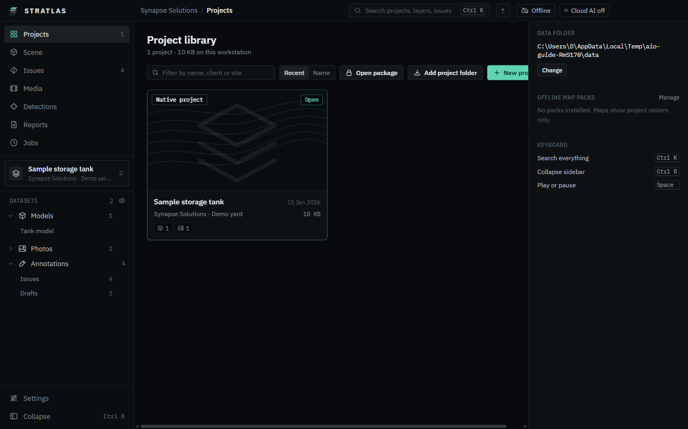
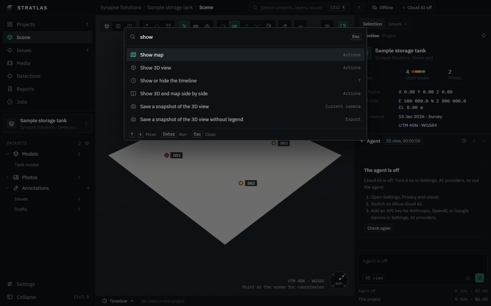

# Projects and the library

The **Projects** screen is the library: every project in the data folder, every folder you added, and every package you opened.

## Open a project

1. Click **Projects** in the sidebar.
2. Type in **Filter by name, client or site** to narrow the list. **Recent** and **Name** change the order.
3. Click a project card. The card shows "Opening", then the project opens.

Most projects open on **Scene**. A project that only holds an original review viewer opens on **Original review**. A read-only package opens on **Welcome** (see [Packages](11-packages.md)).

Each card shows the kind (for example **Inspection kit**, **Volumetric survey**, **Road survey**, **Package**), the capture date, the client and site, the size, and how many models, point clouds, rasters, video clips, photos, panoramas and issues it holds.

## Add projects

- **Add project folder**: pick a folder anywhere that holds a `manifest.json`, or a known kit export. It stays where it is; the library remembers it.
- **Open package**: pick a `.aio` package. See [Packages](11-packages.md).
- **New project**: build a project from raw data. See [Building projects](08-building-projects.md).
- Or copy a project folder into `projects` in the data folder. It shows up the next time the library loads.

## Switch and close projects

- The project switcher at the top of the sidebar lists the projects, then **All projects** and **Close project**.
- Screens that need a project (Scene, Issues, Media, Reports) say "Open a project to see its ..." with your recent projects and **Go to the library**.

## Find anything: the command palette

Press **Ctrl K**, or click **Search projects, layers, issues** in the title bar.

1. Type part of a name: a project, a layer, an issue code, or an action such as "map" or "export".
2. Use the Up and Down keys to pick, **Enter** to run, **Esc** to close.

The palette also has the screens (**Go to Issues**, **Go to Settings**, ...) and actions such as **Show map**, **Fly to the whole site** and **Turn cloud AI off**.

## The sidebar

- **Projects**, **Scene**, **Issues**, **Media**, **Detections**, **Reports** and **Jobs**. **Original review** appears after Scene when the project has one.
- **Datasets** lists the layers of the open project with an eye to show or hide each one.
- **Collapse** (**Ctrl B**) folds the sidebar to icons.

## The original review

Projects imported from a delivered review keep the original viewer. **Original review** shows it as a read-only snapshot. **Back to workspace** returns to the scene.
