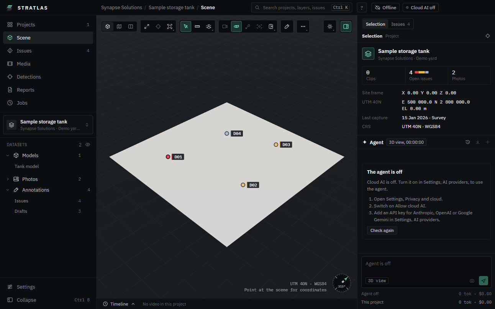

# The scene

**Scene** shows everything a project holds in one place: 3D models, point clouds, maps and orthos, video with the drone's flight, photos and panoramas, and the issues on them.

## Move around in 3D

- Drag with the left mouse button to orbit, with the right button to pan; the wheel zooms.
- **H** or **Whole site**: frame the whole project.
- **F** or **Fly to selection**: fly to what you picked.
- **View presets**: **Iso**, **Top** or **North**. Clicking the compass also turns the view north-up from the top.
- **Esc** or **Select** returns to the pointer.

{product} remembers the camera for each project when you leave Scene and come back.

## 3D, Map and Split

The first buttons of the stage toolbar change the view:

- **3D** (key **1**): the 3D view.
- **Map** (key **2**): a flat map with the orthos, plans and the offline street map.
- **Split** (key **3**): two views side by side. Each side has a selector, **Left side shows** and **Right side shows**: **3D view**, **Map**, **Video**, **Photos**, **Ortho and plans** or **Report**. Only what the project has is offered, and the 3D view can be on one side only.

Projects with more than one survey date also have **Compare dates**. See [Compare dates](04-compare-dates.md).

## Show and hide layers

- In the sidebar, **Datasets** has an eye per layer, one per group (Models, Point clouds, Maps, Video) and one at the top for everything. A half-filled eye means some layers in the group are hidden.
- In the stage toolbar, **Layers and issue pins** turns kinds on and off: **Models**, **Point clouds**, **Photo cameras**, **Maps and rasters**, **Video clips**, and **Street map under the site** in 3D.
- **I** or the pin button turns the issue tags off and back on. **Issue pins** in the same popover shows **All**, only issues at or above a severity, or **Off**, and the **Severity heat map**.
- **L** or **Labels** cycles the component labels: **Off**, **Key** (one per group) and **All**.

## Measure and cut

- **M** or **Measure a distance**: click two points. **Esc** clears it.
- **X** or **Section plane**: turn on **Section**, pick **Vertical** or **Horizontal**, set **Bearing** and **Offset**. **Keep other half** flips the side that stays.

## Point clouds

Click **Point cloud** in the stage toolbar:

- **Colour by**: **RGB**, **Elevation**, **Intensity**, **Classification** or **Flight**.
- **Point size**: 1x is the normal size; 2x and 4x make points at least 2 and 4 pixels.
- **Point budget**: how many million points draw at once. More looks denser and needs a stronger graphics card.
- **Eye-dome lighting**: shades edges so shapes read better.
- **Elevation range** (with Elevation colouring): drag the sliders to stretch the colours; **Auto** resets them.

Detail streams in as you move: coarse first, finer after. The default budget follows the graphics preset (see [Graphics quality](12-settings.md#graphics-quality)).

## Sky, sun and water

Click **Environment and time of day** at the right end of the toolbar (3D only):

- **Backdrop**: **Sky** (daylight from the real sun over the site) or **Studio** (a neutral dark backdrop for a single asset).
- **Time of day** slider and **Date**. **Capture time** jumps to when the data was captured; **Now** to the present.
- **Water** on or off and its **Level**, when the site has a sea level.
- **Project defaults** puts everything back.

Your choices are remembered per project.

## See inside the asset

For tanks, vessels and buildings flown inside, click **See inside the asset: cut or transparent**:

- **Off**: the asset is solid. Nothing is cut automatically.
- **Cut**: cuts the asset open toward you, at the drone while it is inside.
- **Transparent**: draws the asset see-through; set **Opacity**.

Point clouds hide while Cut or Transparent is on. **Inside view** flies behind the drone and looks where it looks.

## Video and the drone

Projects with video have a **Timeline** at the bottom. **T** shows or hides it.

1. Click a clip bar on the timeline: the clip plays from that point. **Space** plays and pauses.
2. The video window floats over the stage. Drag it by its title bar, resize it from the edges (it keeps 16:9), double-click the title to reset. **Dock beside the stage** puts it next to the view; **W** hides it.
3. **P** shows the flight paths (**All**, **Active clip** or **Off**).
4. **Follow the drone** keeps the drone in view. **Drone eye (through the camera)** looks through the drone's camera, so the video lines up with the model.

In the video window: **K** or **Space** pauses, **L** plays (press again for faster), **J** slows down, **,** and **.** step one frame.

### Drone telemetry

**D** or the telemetry button turns it on and off (on by default):

- The flown path is solid up to the playhead, dashed after it.
- A shadow track on the ground with drop lines, and distance ticks from START.
- The HUD plate reads **DIST**, **T+**, **AGL**, **EL**, **GS**, **HDG** and **GMB**.

## Photos and panoramas

- Photos show as small rounded squares with a camera; panoramas as circles. Photos taken within 1.5 m share one marker with a count.
- Hover a marker for the count and the time span. Click it to open the photo; click a merged marker for a list with thumbnails.
- A panorama opens in an immersive view. The arrow keys look around; **Esc** or **Back to 3D** leaves.
- **Media** lists every flight, clip, photo set and panorama set. See [Media and findings](05-annotation-and-issues.md#media-and-findings).

## The right panel

The right panel holds the **Selection** card, the **Issues** list (and **Volumes** on stockpile projects), and the AI agent at the bottom. **Ctrl Alt B** or the right-panel button folds it away.
