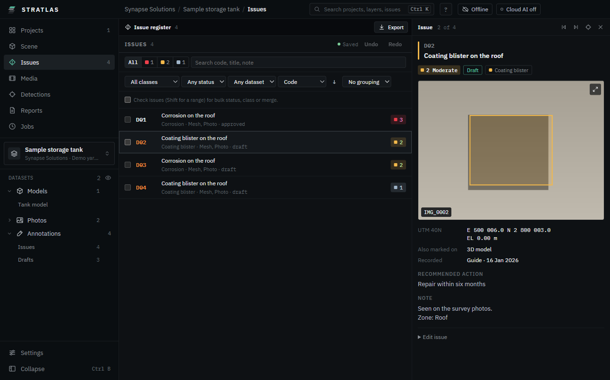
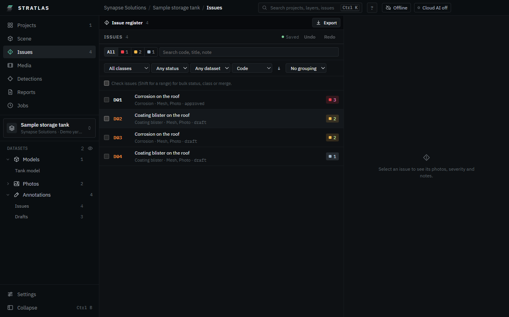

# Annotation and issues

An issue is one defect or finding: a code, a title, a class, a severity and a status, marked on the model, the map, photos or video frames.

## Mark a new issue in 3D

1. On **Scene**, click **Annotate: pins, lines, areas, cloud regions** (or press **A**). A tool bar opens under the stage toolbar.
2. Pick a tool: **Pin**, **Line**, **Area**, **Cloud pt** or **Cloud box** (point clouds).
3. Click on the model. For a line or an area, click each point and finish with **Enter** or a double click.
4. In **New issue**, pick the **Class** and the **Severity** (number keys; **U** for uncertain).
5. Click **Create issue** (or press **Enter**). **Add to** an existing issue code instead adds the mark as another sighting of that issue.

On the **Map**, the tools are **Point**, **Line** and **Area**.

To close the tools, click **Close the annotation tools** or press **A** again. Packages opened read-only have no annotation tools.

## Mark an issue on a photo or a video frame

1. Open the photo from **Media** or from a marker in the scene.
2. Pick **Box** (**B**), **Rotated box** (**R**), **Polygon** (**P**) or **Point** (**O**) and draw on the defect.
3. Pick the class and severity as above.

On a video frame, pause the clip and use **Box** or **Polygon**.

## The issue card

Pick an issue anywhere: a pin or code label in 3D, a map marker, a timeline mark, a row in **Issues**, or **Ctrl K**. The right panel opens with its card:

- Code, title, severity, status (**Draft**, **Reviewed**, **Approved**, **Closed**), class, **Zone** and its place in the list ("4 of 31").
- The best photo cropped around the defect with its box drawn; the other photos in a strip. A video frame has **Jump to** with the time: the clip plays from there.
- **Recommended action** (from the severity model) and **Note**.
- **Previous issue**, **Next issue** and **Fly to the issue**.

### Edit an issue

Open **Edit issue** at the bottom of the card:

- Change **Title**, **Class** and **Severity**, and write the note.
- Move the status on with **Mark reviewed**, **Approve** or **Close** (**Back to** returns it a step).
- Merge two records of the same defect.

Changes save into the project at once.

### Look at the photos full size

1. Click the photo on the card. It opens over the app.
2. Wheel to zoom, drag to pan, **F** to fit.
3. **M** turns the markings off and on. Left and Right step through the issue's photos.
4. **Open in Media** shows the photo with every issue marked on it. **Esc** closes.

### Evidence beside the 3D view

When you pick an issue in the 3D view, the stage switches to **Split** with the issue's photo (or video frame) on the other side, and the 3D view flies to the issue. **Esc** or **×** restores your layout.

To open only the card, switch off **Open evidence in split** on the card.

## The issue register

Click **Issues** in the sidebar.

- Filter by severity, **Search code, title, note**, class, status and dataset.
- Sort by **Code**, **Severity**, **Status**, **Last change** or **Class**; group by severity, class, zone or status.
- Tick several rows for **Set status**, **Set class** or **Merge**.
- Up and Down (or **J** and **K**) move through the list; **Enter** opens the issue. **Ctrl Z** undoes, **Ctrl Y** redoes.
- **Export** saves the issues. See [Reports and exports](10-reports-and-exports.md).

## Media and findings

**Media** lists the flights and clips (**Play in the scene**), the photo sets and the panoramas.

- A photo with findings has a count badge in its worst severity colour, a tinted border and the boxes drawn on the thumbnail. The bar reads, for example, "12 photos with findings".
- **Only with findings** hides the other photos.
- **Order**: **As captured**, **Worst first** or **Most findings first**.
- Click a photo to open it beside the list; mark issues on it as above.

## Severity models

Each project grades issues with its own severity model: levels with a colour, criteria and a recommended action. **Settings**, **Severity models** shows the model of the open project (read only in this version). You choose the model when you create a project.
