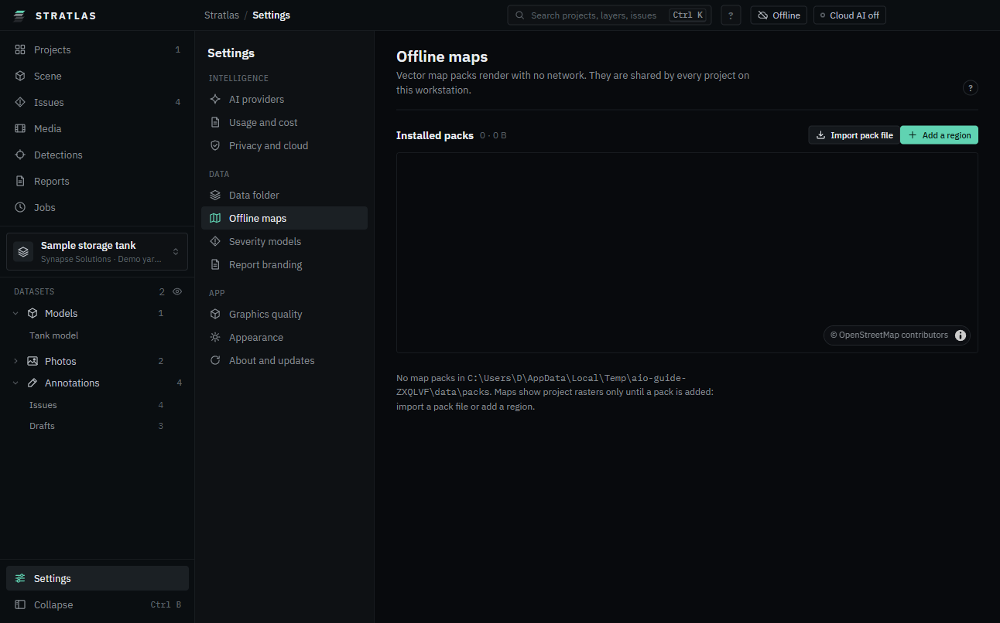

# Maps and offline packs

Street maps come from offline map packs on your disk. One pack serves every project in its area. Orthos and plot plans of a project always show, with or without a pack.

## The map view

1. On **Scene**, click **Map** (or press **2**).
2. Drag to pan, wheel to zoom. Issues show as markers; click one for its card.

Street maps are dark, also in the light theme. With no pack installed, the map says "No map packs installed. Add a pack in Settings, Maps."

In 3D, **Street map under the site** in **Layers and issue pins** lays the street map on the ground around the site. It is on by default for stockpile projects. It is greyed out when no installed pack covers the site.

## Offline map packs

Open **Settings**, **Offline maps**. **Installed packs** lists each pack with its **Region**, **Size**, **Max zoom**, **Built** date and **Bounds**.

### Maps for your projects

**Maps for your projects**, at the top of the page, gets detailed street maps only for the places where you have projects, and nothing else. It says how many projects lack one, for example "3 of 7 projects have no detailed street map", and lists the areas that would fix it:

- **Site area**: a box of 12 km around each site at full detail (zoom 15). Sites close to each other share one box. Well under 1 MB each.
- **Overview** of each country that has a project (zoom 10, coarser for the largest countries). From about 0.2 MB for a small country to a few tens of MB for the largest.
- **World overview**: the whole world at zoom 6, about 33 MB, so the Globe shows a street map at every zoom.

Each area shows its **Estimated size**, and the last row the total. An area that an installed pack already covers is not listed.

1. Untick any area you do not want. **Show** draws it on the coverage map.
2. Click **Download**. The button shows the total, for example "Download about 36 MB".

The areas appear under **Downloads** and install like any other region, with the same **Resume** and the same check. The download comes from build.protomaps.com, which sees the areas asked for and nothing about your projects.

When everything is covered, the panel says "Nothing to download". A project that is not placed on the Earth (a local grid, or a coordinate system {product} does not know) gets no map.

**When you open a project** that has no detailed street map, a small notice at the bottom right names the same areas and their size. **Download** starts them, **Choose areas** opens this panel, and closing the notice is fine too: it does not come back for that project. Turn the notice off with **Tell me when an opened project has no detailed street map**.

**Download street maps for new projects automatically** is off by default. With it on, the first time you open a project that is placed on the Earth, its missing areas are queued in **Downloads** without asking; a notice says so, and you can cancel them there.

In **Offline only** nothing is downloaded, whatever these switches say. The panel still lists what is missing: switch to **Online** in the title bar (see [Online or offline only](01-install.md#online-or-offline-only)), or bring the packs in with **Import pack file**.

If a project leaves the library, the panel says, for example, "2 packs cover areas with no project any more". Click **Review**, then **Remove** on a pack and confirm. The world overview is never offered for removal.

### Import a pack file

Use this on a workstation with no network.

1. Click **Import pack file**.
2. Pick a `.pmtiles` file (for example from a USB drive).

The pack appears under **Installed packs**.

### Download a region

{product} downloads map data only when you start it (or have turned on **Download street maps for new projects automatically**, above), from build.protomaps.com. The workstation must be **Online**: click the mode in the title bar, switch to **Online**, then **Download maps** (see [Online or offline only](01-install.md#online-or-offline-only)). In **Offline only**, **Download** is greyed and the page says to import a pack file instead.

1. Click **Add a region**.
2. Pick the area: **Country** (choose from the list) or **Draw a box** (drag on the map).
3. Give it a **Region name**.
4. Pick the **Detail**, from **Zoom 6: country overview** to **Zoom 15: full detail**. The size estimate updates.
5. Click **Download**. The button shows the size, for example "Download about 120 MB".

**Downloads** shows the progress. If the download stops (network, or you quit {product}), it shows **Interrupted**: click **Resume** to continue from where it stopped. The finished pack is checked tile by tile.

If the workstation is set to offline-only, downloads are off: "This workstation is offline-only. Import a pack file, or turn off offline-only in Privacy and cloud."

### Remove a pack

Click **Remove** on the pack's row, then confirm. Maps lose that area until the pack is added again. A pack that came with an open package shows **In open package** and cannot be removed.

## Maps inside packages

A package can carry the map region around its site, so the customer sees street maps with no pack installed. See [Packages](11-packages.md#include-the-map-region).
