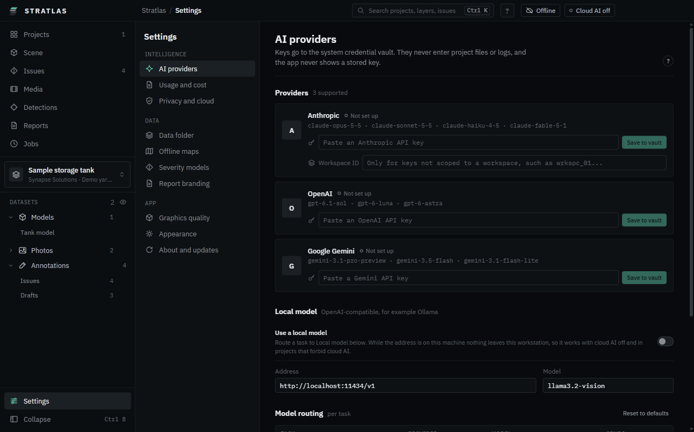

# AI agent

The agent answers questions about the open project and does things for you: moves the camera, plays a clip at a time, lists and summarises issues, drafts an issue. It uses a cloud AI provider with your own API key, or a local model on this workstation.

Cloud AI is off until you switch it on. Nothing leaves the workstation while it is off.

## Add a provider and a key

1. Open **Settings**, **AI providers**.
2. Under **Providers**, find **Anthropic**, **OpenAI** or **Google Gemini**.
3. Paste the key in the field (for example **Paste an Anthropic API key**) and click **Save to vault**.
   - The key goes to the system credential vault. It never enters project files or logs, and {product} never shows it again.
   - To change it, click **Replace key**.
4. Click **Test connection**. It sends one short message to check the key and the model.

### Anthropic workspace ID

Some Anthropic keys are not tied to a workspace. Then every request must name one:

1. In the Anthropic Console, copy the workspace ID (it looks like `wrkspc_01...`).
2. In **Settings**, **AI providers**, enter it in **Workspace ID** under Anthropic.
3. Click **Test connection** again.

If the agent stops with this error, it shows a **Workspace ID needed** card: enter the ID in **Anthropic workspace ID** and click **Test and retry** (it sends your last message again, once). **Open AI settings** takes you to the field.

### A local model

Under **Local model**, switch on **Use a local model** and enter the **Address** and the **Model** of an OpenAI-compatible server on this workstation (for example Ollama). Nothing goes to the cloud.

### Which model does what

**Model routing** lists each task with its provider and model, and what it **Sends**:

| Task                   | Sends              |
| ---------------------- | ------------------ |
| Agent chat             | Text, view context |
| Photo and frame vision | Frames, crops      |
| Report writing         | Issue text         |
| Structured extraction  | Text, tables       |
| Build from drawings    | Drawings, clouds   |

**Reset to defaults** puts the routes back.

## Switch cloud AI on

1. Open **Settings**, **Privacy and cloud**.
2. Switch on **Cloud AI**. The title bar chip changes from **Cloud AI off** to **Cloud AI**.

**Ctrl K**, **Turn cloud AI on** does the same. A package can forbid cloud AI: then the chip reads **Cloud AI blocked** and nothing from it is sent.

## Talk to the agent

The agent sits at the bottom of the right panel on **Scene** (open the panel with **Ctrl Alt B** if it is folded).

1. Type in **Ask about this view, or tell the agent what to do** and press **Enter** (**Shift Enter** for a new line).
2. Each step the agent takes shows in the panel. **Esc** or **Stop** stops it.
3. **Undo** on a step takes it back (camera moves, selections, layer changes, draft issues).

### Move the camera

Ask in plain words, for example:

- "top view", "orbit", "zoom in", "frame everything"
- "go to issue F05", "fly to tank 3", "show the jetty"
- "go to 25.1000, 55.2000"
- "where the drone was at 13:25"

After each move the agent says where the camera is. If a name fits several places, it lists them and asks which one.

### Conversations

- **Conversations in this project** lists earlier conversations; **New conversation** starts a fresh one.
- **Export this conversation as Markdown** saves it as a file.
- The footer shows the model, the tokens and the estimated cost of the conversation and the project.

## What is sent and when

- Nothing is sent while **Cloud AI** is off, or to a local model.
- The first message to a cloud provider in a project shows **Send to** ... with exactly what leaves the workstation: **Provider and model**, **Your message**, **Window context (text)** and **Attached frame**. Tick **Always allow for this project** to skip this preview next time.
- The window context is text only: the project name, client and site, the time and the active clip, what is selected, the visible layer names, and counts of layers, clips and issues. No photos, positions or issue notes.
- A frame (an image of the view) is sent only when you attach it with the camera button, or approve a step that sends one.
- Steps that send data or change the project wait for **Approve** or **Reject**: drafting an issue, sending a frame, writing issues to a CSV file. **Settings**, **Privacy and cloud** keeps **Ask before data-sending actions** and **Ask before changing project data** always on.
- **Settings**, **Usage and cost** shows the tokens and the estimated cost per project and provider. The estimate uses list prices; your provider's invoice is what counts.

Detecting defects in photos with AI and drafting report text work the same way, each with its own preview. See [Building projects](08-building-projects.md#detect-with-ai) and [Reports and exports](10-reports-and-exports.md#report-text).
