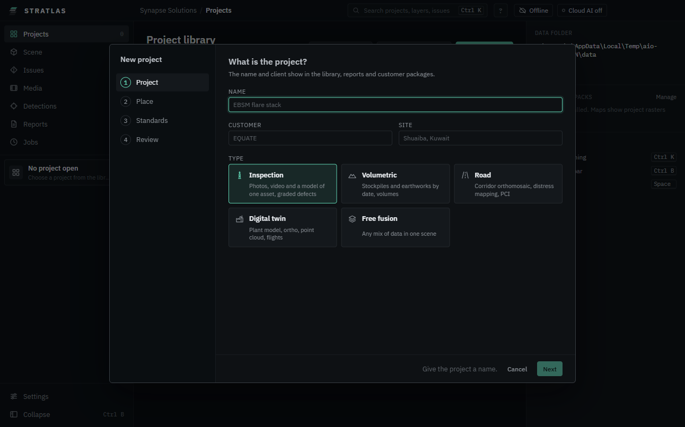

# Building projects

Build a project from raw data: photos, video with its flight log, models, orthos, elevation models and point clouds. Heavy processing runs as jobs from the pipeline pack, on this workstation.

## Create a project

1. On **Projects**, click **New project** (or **Ctrl K**, **New project**).
2. **What is the project?** Enter the **Name**, **Customer** and **Site**, and pick the type:
   - **Inspection**: photos, video and a model of one asset, graded defects.
   - **Volumetric**: stockpiles and earthworks by date, volumes.
   - **Road**: corridor orthomosaic, distress mapping, PCI.
   - **Digital twin**: plant model, ortho, point cloud, flights.
   - **Free fusion**: any mix of data in one scene.

   Click **Next**.

3. **Where is it?** Set the origin, the point all positions are measured from:
   - **First GPS photo**: click **Pick a photo**; its GPS position, altitude and date are used.
   - **Typed coordinate**: latitude, longitude and height (`25.1000, 55.2000, 12`), or easting, northing and height.
   - **Click on the map**: click the site on the offline map.

   The **Coordinate reference system** list then selects the matching UTM zone, marked "site zone". Search by zone, country or EPSG code to pick another. Click **Next**.

4. **How are findings graded?** Pick the **Severity model**: **General inspection (1 to 3)**, **Road distress (ASTM D6433)** (preselected for roads), or the model of one of your projects. Click **Next**.
5. **Create the project**: check the summary and click **Create project**. The project opens empty.

## Import raw data

1. Drag files onto the window, or click **Import files** (or **Ctrl K**, **Import raw data into this project**).
2. {product} takes photos, video with its `.SRT` log, GLB or OBJ models, GeoTIFF orthos and DSMs, and point clouds.
3. Each file reports **Imported**, **Skipped**, **Queued** (a job converts it) or **Failed**.

- A DJI video with its `.SRT` becomes a clip with its flight path, in sync with the timeline.
- A LAS or LAZ point cloud is converted by a job in **Jobs**; the cloud appears when the job is done.
- A GLB or OBJ model can be placed with **Georeference a model by point pairs** (**Ctrl K**): click a point on the model (**Pick on model**), then the same point on the scene, map or photo, three times or more; **Apply and save**.

### Camera heights

When photos or a video logged only the height above the take-off point, the **Camera heights** card asks how to place the cameras:

- **Relative altitude + take-off height**: enter **Take-off height H (m)**. {product} proposes it from the model under the take-off point, or from the origin height with a warning.
- **Absolute altitude + datum offset**: enter **Offset (m)**. It is saved as the project's vertical datum.

After the import the panel says which altitude was used and with which number. One take-off height applies to the whole import: import flights that took off at different heights separately.

## Run a job

Jobs run the pipelines of the pipeline pack. The pack lives in `runtime` in the data folder; **Jobs** shows "Pipeline pack" and its version at the top.

1. Click **Jobs**, then **New job**.
2. Pick the **Pipeline** and the **Project folder**, fill in the pipeline's fields, and click **Start job**.
3. Each step shows its progress; the log is below. The job ends **Done**, **Failed** or **Cancelled**.

**Cancel** stops a running job. A job stopped by quitting {product} shows **Interrupted**; **Resume** carries on from the next step. **Open output** and **Log file** show what it wrote.

The pipelines:

- **Cameras from photos**, **Place findings on the model**, **Findings register and stats**
- **Inspection: detections to issues**: places reviewed detections on the model and groups them into issues.
- **Volumetric survey** and **Stockpile volumes**: see [Volumes](09-volumes-and-roads.md).
- **Road survey**: see [Roads](09-volumes-and-roads.md#roads).
- **Point cloud to COPC**: converts LAS and LAZ for streaming.
- **Check the pipeline pack**

Jobs write into the open project, always with a backup, and never drop your own issues.

## Review detections

Detections are boxes or outlines on photos and video frames, from you, a model or cloud AI. Every pass is a file in `detections` in the project folder.

1. Click **Detections** in the sidebar. The top reads, for example, "9 waiting · 8 accepted · 0 rejected".
2. **Photos shown**: **With detections** or **All photos**. Pick a photo on the contact sheet.
3. For each box:
   - **Accept** (**A** or **Enter**): it becomes a draft issue. **Open in Issues** shows it.
   - **Link** (**L**): find an issue by code or title; the box becomes another sighting of it.
   - **Reject** (**X**) a false alarm. **Reopen** takes the decision back.
4. Set **Class** (**C**), **Severity** (number keys), **Uncertain (U)** and **Note (N)** in the inspector.
5. **J** and **K** step through the detections. The confidence slider hides proposals under "Confidence N% and up".

**Ctrl Z** and **Ctrl Y** undo and redo. **Ctrl**+click selects several tiles; **Clear selection** empties it. The state reads **Saved** once your decisions are written into the detection file.

Run **Inspection: detections to issues** afterwards to place the accepted boxes on the model. It never makes a second issue for the same box.

## Detect with AI

Needs cloud AI on and a key with a vision model (see [AI agent](07-ai-agent.md)).

1. On **Detections**, **Ctrl**+click a few photos, then **Detect with AI**.
2. **What to send**: the selected photos, the photo in the editor, all photos without detections, or **Video frames** (a **Clip** and **One frame every** N **seconds**). Set **Images per request** and, optionally, **What to look for**.
3. Read the **Estimate** of tokens and cost.
4. **What leaves this workstation** shows thumbnails of exactly the images that go out; **Instructions and request text** shows the full request.
5. Click **Send**. **Stop** stops it. When it is **Done** you see the tokens and the cost.

Results arrive as **Waiting** detections ("Proposed by" the model, with a confidence). Nothing counts until you accept it.

To find defects with a model on this computer instead, with nothing sent and no cost, pick **Local model** under **Detect with**. See [Local detection with ONNX models](19-local-detection.md).

## Calibrate video

When the video does not sit on the model, calibrate it: **Ctrl K**, **Calibrate video: time offset and field of view**.

- **Time offset**: scrub to a visible event (a turn, a vehicle, the take-off) and nudge until the frame and the model move together.
- **Field of view**: widen or narrow the model view until edges line up.
- **Orientation** (**Pitch**, **Yaw**, **Roll**) and **Position** (**East**, **North**, **Up**, metres) offsets, each with a live preview.
- **Point pairs**: click a sharp feature in the frame, then the same feature on the model (or type its coordinate), **Add pair**. Three to six pairs across the frame, then pick **Values to fit** and click **Fit**. **Before fit**, **Error now** and **Held out** show how well it fits.
- **Refine automatically** lines the frame up with the model by their edges. On busy plants it may say the edges do not agree: use point pairs.

Click **Save calibration**. Tick "Use this orientation and position for all ... clips of this flight" to apply it to the whole flight. **Reset** goes back to the saved values.
