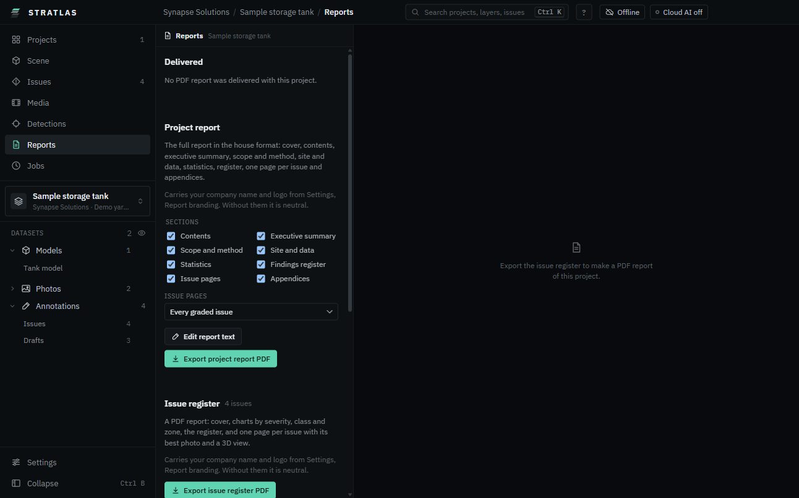

# Reports and exports

**Reports** holds the delivered PDF reports of a project, the project report you generate, the issue register and the customer package.

## Report branding

Your company name and logo go on every report {product} generates. Delivered reports are never changed.

1. Open **Settings**, **Report branding**.
2. Type the **Company name** and press **Enter**.
3. **Choose logo**: PNG, JPG or SVG up to 5 MB. It is kept on this workstation, never in a project folder.
4. Optional: an **Accent colour** for the cover and headings. **Reset** uses the house colour.

The **Cover preview** shows the result. Without branding, reports are neutral: the project name, no logo, and a small "Made with {product}" line.

## Report text

The project report prints an executive summary, the method and a findings overview. Write them once per project:

1. **Reports**, **Report text**, **Edit report text**.
2. Start the text:
   - **Fill from template** writes the facts from the project statistics. Replace the parts in [brackets].
   - **Draft with AI** (cloud AI on) writes a draft. The first time, a preview shows exactly what is sent: the instructions and the statistics, no photos, positions or notes. Click **Send**.
3. Edit the text and click **Save version**.

**Versions** lists every saved version (**AI draft**, **Template**, **Edited**); **Restore this version** brings one back. **Back to the reports** returns.

## Project report

The full report in the house format: cover, contents, executive summary, scope and method, site and data with a locator map, statistics, findings register, one page per issue and appendices.

1. **Reports**, **Project report**.
2. Tick the **Sections** you want.
3. **Issue pages**: **Every graded issue**, **All but the lowest level** or **None, register only**. Road surveys default to all but the lowest level.
4. Click **Export project report PDF** and choose where to save it.

Stockpile projects add the stockpile map and the volume table; road projects the road ratings. A project with no issues still prints.

## Issue register

**Reports**, **Issue register**, **Export issue register PDF**: every issue with its photo, severity and note, with your branding.

## Export issues and views

On **Issues**, **Export** saves:

- **Issues CSV**: one row per issue, for spreadsheets.
- **GeoJSON**: issues on the map, for GIS.
- **COCO JSON**, **Kit JSON** and **Masks ZIP**: detections and masks for other tools.
- **Issue register report (PDF)** and **Project report (PDF)**.
- **3D view snapshot (PNG)**, with or without **Legend on the 3D snapshot**.

**Ctrl K** finds the same exports: type "export".

## Customer packages

To send a whole project to a customer who opens it in {product} without editing it, see [Packages](11-packages.md).
