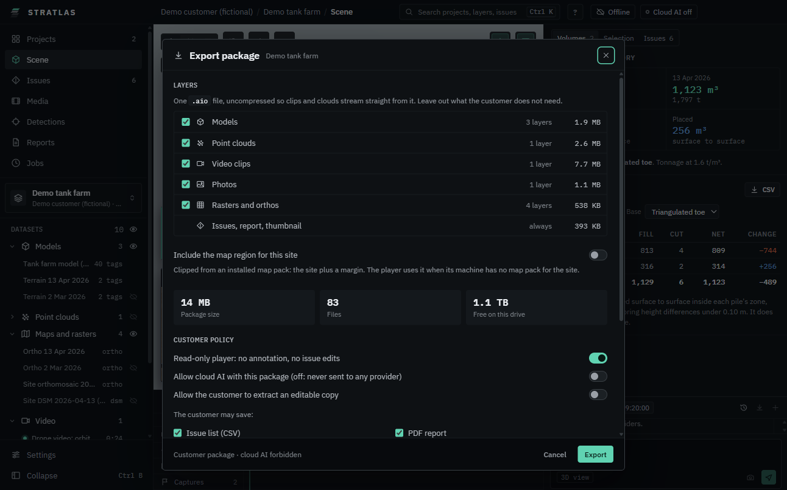

# Packages

A package is one `.aio` file with a whole project: layers, issues, report and thumbnail. The customer opens it in {product} as a read-only player. Nothing in it can be changed, and it is never written to.

## Export a package

1. Open the project. On **Reports**, under **Customer package**, click **Export package** (or **Ctrl K**, **Export project package**).
2. **Layers**: untick what the customer does not need. Leaving out **Point clouds** keeps the package small. Issues, report and thumbnail always go in.
3. **Customer policy**:
   - **Read-only player: no annotation, no issue edits** (on by default).
   - **Allow cloud AI with this package**: off means nothing from it is ever sent to any provider.
   - **Allow the customer to extract an editable copy**.
   - **The customer may save**: the issue list, the PDF report, screenshots and views, and other exports you tick.
4. Optional: **Encrypt with a passphrase (AES-256)**. Type the **Passphrase** twice (at least 8 characters). Send it to the customer separately.
5. Optional: a **Welcome note** the customer sees first.
6. Check the **Package size** and the free space, then click **Export** and choose where to save. "Package written." shows the file and its size.

### Include the map region

So the customer sees street maps without a map pack:

1. Switch on **Include the map region for this site**.
2. Set **Detail up to zoom** and the **Margin** around the site.

A line reads "From" the pack, with the number of tiles and their size, and the package size grows. The region is clipped from an installed map pack (see [Maps](06-maps.md)).

## Open a package

- Double-click the `.aio` file, or on **Projects** click **Open package** (or **Ctrl K**, **Open a project package (.aio)**).
- An encrypted package asks for the **Passphrase**; click **Open package**.

It opens on **Welcome**: the client, site, capture date and issue count, tips on what to try, **Start exploring** and **Open the issue register**. The title bar shows **Read-only package**. There are no annotation tools, and cloud AI is off unless the package allows it.

A package of a survey project shows its survey measurements, sections, terrain overlays, comparison results, designs and QA status: **Survey measurements**, **Measurements** lists them and the views draw them. They are read only: there are no drawing tools, no **Save**, and **Site settings** can be read but not saved. Nothing runs in a package, so a section cannot be downloaded and a result that is out of date stays out of date.

The map region in the package shows in **Settings**, **Offline maps** as **In open package**.

## Extract to edit

If the sender allowed it, you can turn a package into a normal project:

1. Open the package. On **Reports** (or on **Welcome**), under **Edit a copy**, click **Extract to edit**.
2. A new project is made in your data folder, with every layer, issue and edit, and opens. The title bar shows "Copy of" and the file name.

Annotate and change the copy as any project. The `.aio` file stays as it was.

A package exported without the allow switch says: "The sender did not allow editing this package. Ask them for a package that allows extract to edit."
