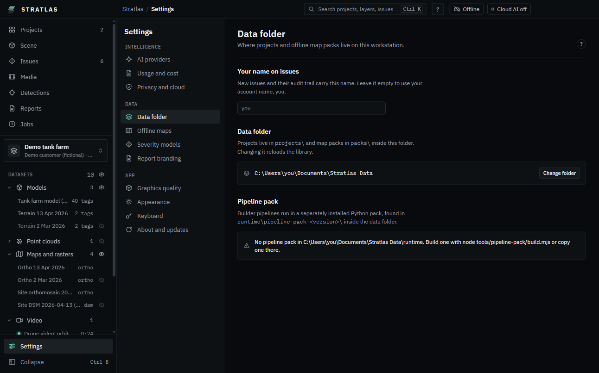
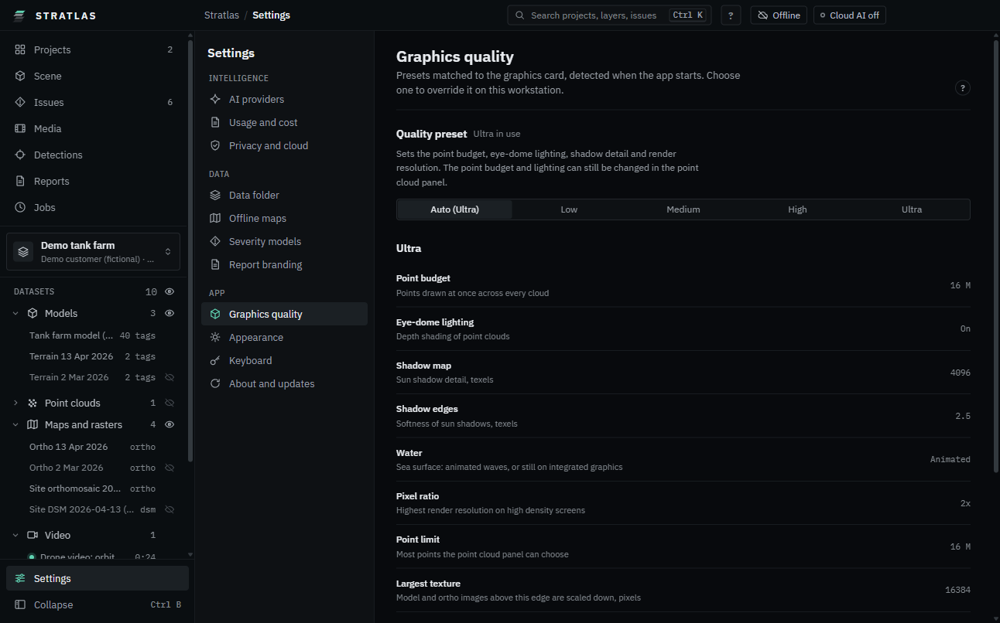

# Settings

Click **Settings** at the bottom of the sidebar. The pages are grouped:

- **Intelligence**: **AI providers**, **Usage and cost**, **Privacy and cloud** (see [AI agent](07-ai-agent.md)). **AI providers** also holds the **Local model** (see [Set up a local model](20-local-model.md)) and the **Detection models** (see [Local detection with ONNX models](19-local-detection.md)).
- **Data**: **Identity and team** (see [Identity and team](21-identity-and-team.md)), **Data folder**, **Offline maps** (see [Maps](06-maps.md)), **Severity models**, **Report branding** (see [Reports](10-reports-and-exports.md#report-branding)).
- **App**: **Graphics quality**, **Appearance**, **About and updates**.

The **?** at the top right of each page opens its section of this guide.

Two title bar chips open a page directly: the mode chip (**Online** or **Offline only**) has **Download maps**, which opens **Offline maps**, and the cloud AI chip opens **Privacy and cloud**. See [Online or offline only](01-install.md#online-or-offline-only).

## Data folder

The data folder holds `projects`, `packs` (offline maps) and `runtime` (the pipeline pack).

1. **Settings**, **Data folder**.
2. Click **Change folder** and pick the folder. The library reloads.

On the same page:

- **Pipeline pack**: the version {product} found in `runtime`, or what is missing.
- **Team server** (**Preview**): connect to your team's own server. See [Team server (preview)](26-team-server.md).

The name recorded on your issues is now on **Identity and team**, with your initials (see [Identity and team](21-identity-and-team.md)).

## Graphics quality

{product} picks a preset for the graphics card when it starts. To choose another on this workstation:

1. **Settings**, **Graphics quality**.
2. Click **Low**, **Medium**, **High** or **Ultra**. **Auto** goes back to the detected preset.

| Preset | Points | Eye-dome lighting | Shadow map | Water    | Pixel ratio |
| ------ | ------ | ----------------- | ---------- | -------- | ----------- |
| Low    | 2 M    | off               | 1024       | still    | 1x          |
| Medium | 4 M    | on                | 2048       | animated | 1x          |
| High   | 8 M    | on                | 4096       | animated | 1.5x        |
| Ultra  | 16 M   | on                | 4096       | animated | 2x          |

Integrated graphics get **Low**; laptop graphics one step lower than the desktop card. **Graphics card** shows what the system reports. Changes in the point cloud panel after picking a preset are kept.

## Appearance

- **Theme**: **Dark** (the working theme), **Light** (bright rooms, printouts) or **System**.
- **Layout direction**: **Left to right** or **Right to left**. Right to left mirrors the panels; maps, timelines and the 3D view keep their orientation.
- **Launch screen**: **Show launch screen** is on by default. Switch it off to go straight to your projects when {product} starts. See [First start](01-install.md#first-start).
- **Language**: English.

## About and updates

- The version and the build line ("Build" with the date and commit). Quote it when you report a problem.
- **Folders**: **Open** the data folder, the app settings or the logs. **Export logs** saves them as one text file.
- **Install update from file**: click **Choose installer**, pick a newer installer; {product} checks it, then **Install and restart**. Works with no network.
- **Check for updates online**: off by default. Switch it on to check an update address you were given.
- **Third-party licences** used by {product}.

## Keyboard shortcuts

The same list is in **Settings**, **Keyboard**. On a Mac, Ctrl is ⌘ (Command) and Alt is ⌥ (Option); {product} shows the Mac keys there and in its tool tips.

### Anywhere

| Keys       | Does                                     |
| ---------- | ---------------------------------------- |
| Ctrl K     | Open or close the command search         |
| Ctrl B     | Collapse or expand the sidebar           |
| Ctrl Alt B | Collapse or expand the right panel       |
| Space      | Play or pause the video and the timeline |
| Alt ←      | Go to the previous survey date           |
| Alt →      | Go to the next survey date               |
| F1         | Open or close the user guide             |

### Scene: 3D, map and split

| Keys         | Does                                                      |
| ------------ | --------------------------------------------------------- |
| 1            | Show the 3D view                                          |
| 2            | Show the map                                              |
| 3            | Show 3D and map side by side                              |
| H            | Whole site                                                |
| F            | Fly to the selection                                      |
| M            | Measure on or off                                         |
| X            | Section on or off                                         |
| L            | Next component label mode                                 |
| A            | Annotation tools on or off                                |
| W            | Show or hide the video window                             |
| P            | Flight paths: all, active clip, off                       |
| D            | Drone telemetry on or off                                 |
| I            | Issue pins on or off                                      |
| T            | Show or hide the timeline                                 |
| C            | Inside the asset: view from the drone camera              |
| Esc          | Stop the current tool, close the photo beside the 3D view |
| Enter        | Finish the shape you are drawing                          |
| Backspace    | Remove the last point you drew                            |
| Ctrl Shift F | Frame rate and memory readout                             |

### Road surveys

| Keys | Does                              |
| ---- | --------------------------------- |
| P    | PCI grid on or off                |
| D    | Defect density on or off          |
| M    | Measure on the map                |
| C    | Close-up of the defect on the map |
| →    | Next defect in the list           |
| ←    | Previous defect in the list       |

### Editing a stockpile

| Keys              | Does                              |
| ----------------- | --------------------------------- |
| Delete, Backspace | Delete the selected outline point |
| Enter             | Save the outline                  |
| Ctrl Z            | Undo the last outline change      |

### Issue edits

| Keys                 | Does                     |
| -------------------- | ------------------------ |
| Ctrl Z               | Undo the last issue edit |
| Ctrl Y, Ctrl Shift Z | Redo the issue edit      |

### Issue list

| Keys  | Does                             |
| ----- | -------------------------------- |
| ↓, J  | Next issue                       |
| ↑, K  | Previous issue                   |
| Home  | First issue                      |
| End   | Last issue                       |
| Enter | Open the issue card              |
| Space | Tick the issue for a bulk change |

### Photo with marks

| Keys | Does                   |
| ---- | ---------------------- |
| V    | Select tool            |
| B    | Box tool               |
| R    | Rotated box tool       |
| P    | Polygon tool           |
| O    | Point tool             |
| F    | Fit to the window      |
| +    | Zoom in                |
| -    | Zoom out               |
| M    | Mask overlay on or off |

### Full-size photo

| Keys         | Does              |
| ------------ | ----------------- |
| Esc          | Close             |
| →, Page Down | Next photo        |
| ←, Page Up   | Previous photo    |
| F, 0         | Fit to the window |
| +            | Zoom in           |
| -            | Zoom out          |
| M            | Marks on or off   |

### Video window

| Keys                               | Does                              |
| ---------------------------------- | --------------------------------- |
| ←, →, ↑, ↓                         | Move the window                   |
| Shift ←, Shift →, Shift ↑, Shift ↓ | Move the window further           |
| +                                  | Make the window larger            |
| -                                  | Make the window smaller           |
| Home                               | Put the window back in its corner |

### Annotating video

| Keys | Does                        |
| ---- | --------------------------- |
| V    | Select tool                 |
| B    | Box tool                    |
| P    | Polygon tool                |
| K    | Add a keyframe at this time |
| I    | Mark where the event starts |
| O    | Mark where the event ends   |
| Esc  | Stop annotating the video   |

### Inside a 360 panorama

| Keys       | Does               |
| ---------- | ------------------ |
| ←, →, ↑, ↓ | Look around        |
| +, -       | Zoom in or out     |
| Esc        | Leave the panorama |

### Detections review

| Keys                                 | Does                      |
| ------------------------------------ | ------------------------- |
| J, →, ↓                              | Next detection            |
| K, ←, ↑                              | Previous detection        |
| Shift J, Shift →, Shift ↓, Page Down | Next photo or frame       |
| Shift K, Shift ←, Shift ↑, Page Up   | Previous photo or frame   |
| A, Enter                             | Accept                    |
| L                                    | Link to an existing issue |
| X                                    | Reject                    |
| Shift R                              | Reopen                    |
| Delete                               | Delete                    |
| U                                    | Mark as uncertain         |
| C                                    | Next class                |
| Shift C                              | Previous class            |
| N                                    | Write a note              |
| 0, 1, 2, 3, 4, 5, 6, 7, 8, 9         | Set the severity          |
| V                                    | Select tool               |
| B                                    | Box tool                  |
| R                                    | Rotated box tool          |
| P                                    | Polygon tool              |
| O                                    | Point tool                |
| M                                    | Mask on or off            |
| F                                    | Fit to the window         |
| Ctrl Z                               | Undo                      |
| Ctrl Y, Ctrl Shift Z                 | Redo                      |

### PDF report

| Keys         | Does               |
| ------------ | ------------------ |
| Page Down, → | Next page          |
| Page Up, ←   | Previous page      |
| Home         | First page         |
| End          | Last page          |
| +            | Zoom in            |
| -            | Zoom out           |
| Ctrl F       | Find in the report |

### Command search

| Keys  | Does                        |
| ----- | --------------------------- |
| ↑, ↓  | Move through the results    |
| Enter | Run the highlighted command |
| Esc   | Close                       |

### Agent message box

| Keys        | Does             |
| ----------- | ---------------- |
| Enter       | Send the message |
| Shift Enter | New line         |
| Esc         | Stop the reply   |

### Dialogs and popovers

| Keys           | Does                                          |
| -------------- | --------------------------------------------- |
| Esc            | Close                                         |
| Tab, Shift Tab | Move between the controls; focus stays inside |
